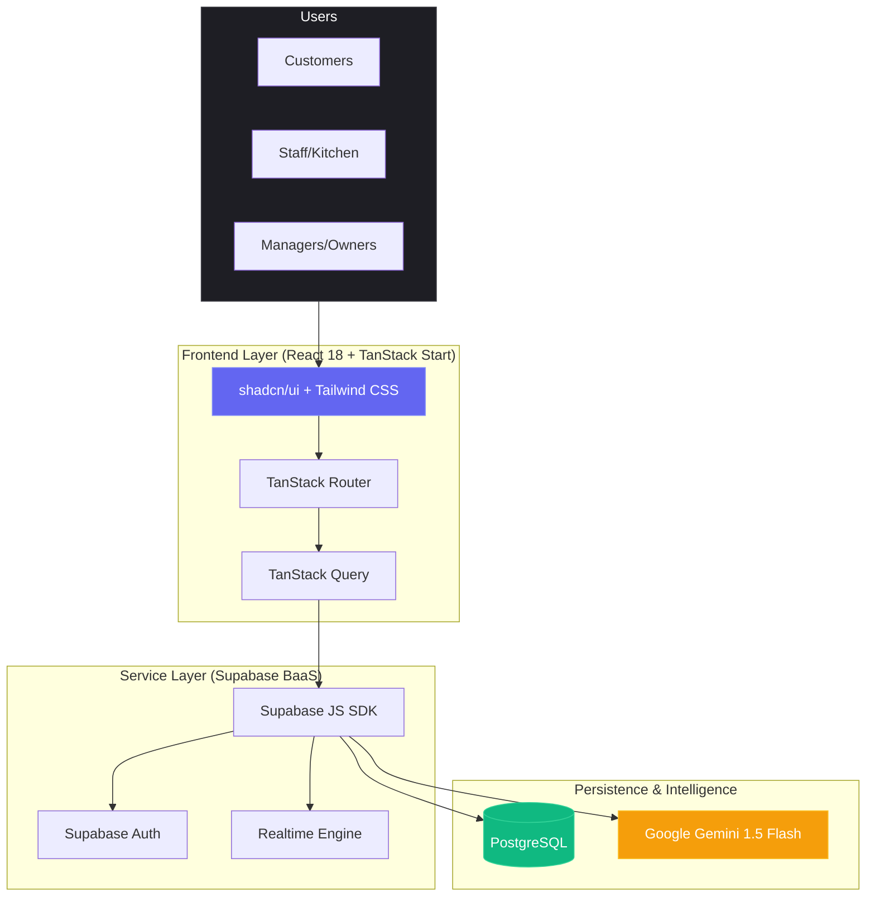
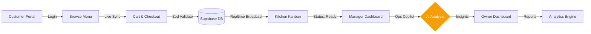
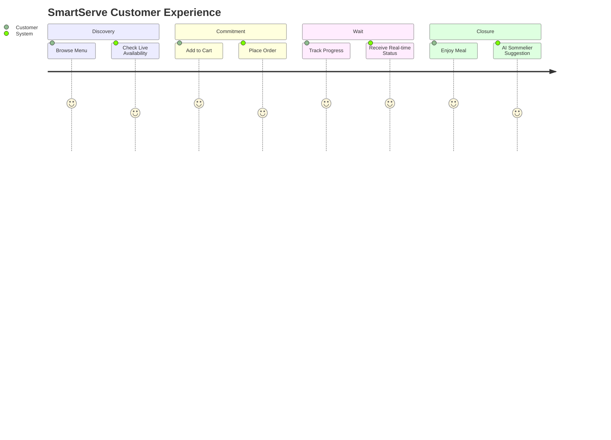
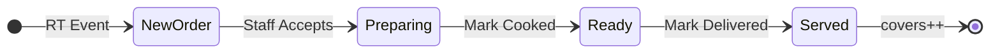
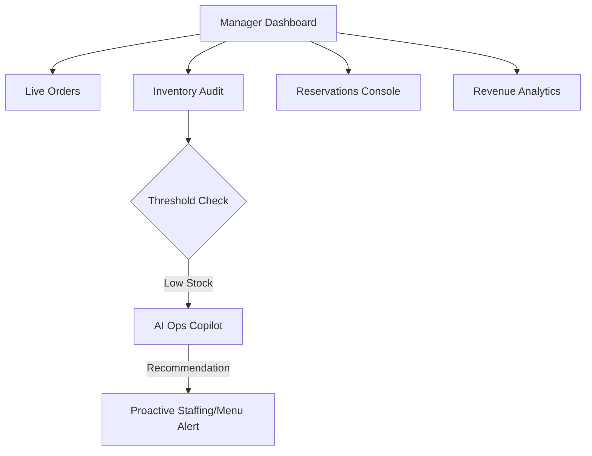
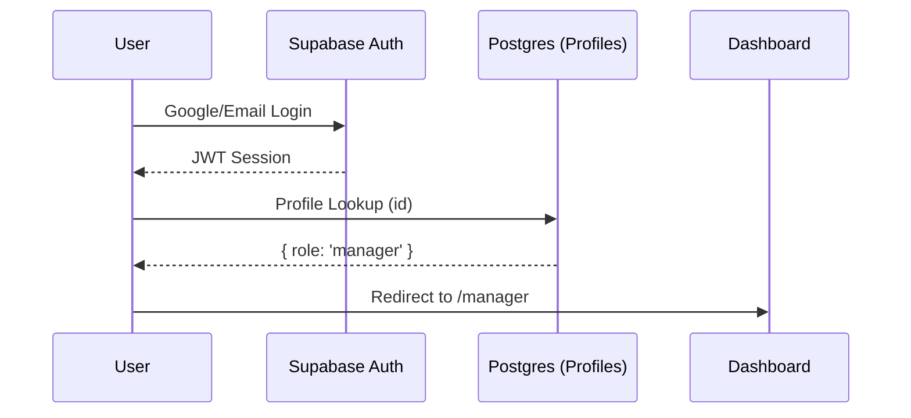
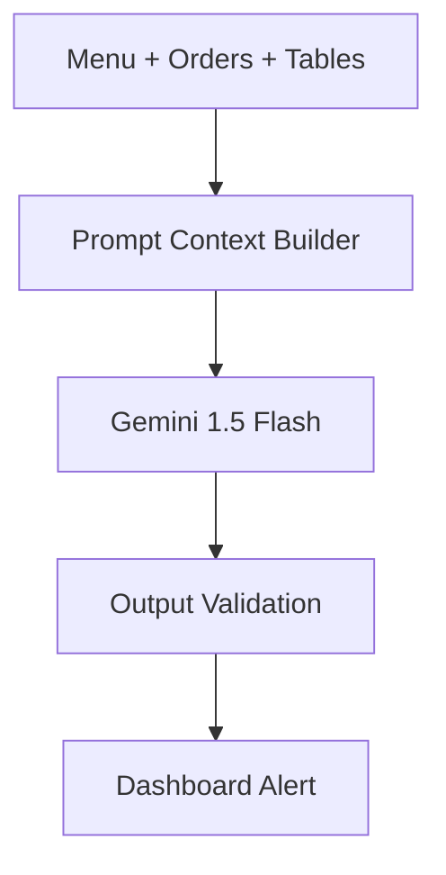
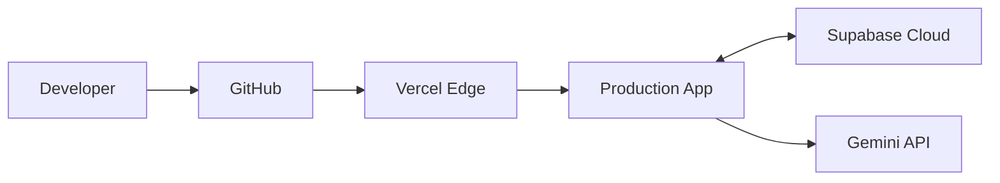
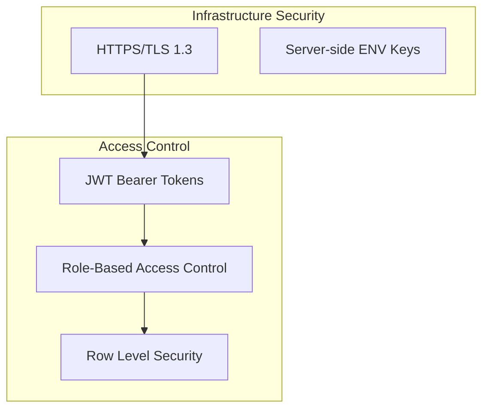
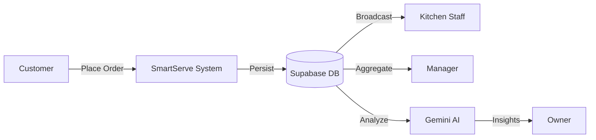

# 🏛️ SmartServe — Enterprise Architecture & System Design Document (SDD)

This document provides a comprehensive, enterprise-grade technical blueprint of the **SmartServe AI-Powered Restaurant Operating System**. It is designed for hackathon judges, technical reviewers, and potential investors.

---

## 🎨 Global Design System
- **Color Palette**: 
  - `Primary`: #6366f1 (Indigo - Logic/Auth)
  - `Secondary`: #10b981 (Emerald - Realtime/Sync)
  - `Accent`: #f59e0b (Amber - AI/Intelligence)
  - `Surface`: #09090b (Zinc - Backgrounds)
- **Visual Styles**: 12px rounded corners, professional icons, isometric flow lines.

---

## 1. High-Level System Architecture
**Purpose**: To provide a holistic view of the SmartServe ecosystem and technology stack dependencies.

---

## 2. Complete End-to-End Workflow
**Purpose**: Visualize the lifecycle of an order from customer intent to owner reporting.

---

## 3. Customer Journey Map
**Purpose**: Map user emotional states and system responses during the dining experience.

---

## 4. Staff Workflow (Kitchen Sync)
**Purpose**: Optimize the "Order-to-Table" velocity for floor and kitchen staff.

---

## 5. Manager Workflow (Ops Control)
**Purpose**: Showcase the centralized management of tables, inventory, and staff.

---

## 6. Authentication Sequence
**Purpose**: Detail the secure JWT-based onboarding and role detection flow.

---

## 7. AI Reasoning Workflow
**Purpose**: Explain how Gemini processes restaurant context to provide grounding.

---

## 8. Deployment Architecture
**Purpose**: Technical view of the production environment.

---

## 9. Security Architecture
**Purpose**: Illustrate data encryption and access control boundaries.

---

## 10. Data Flow Diagram (Level 1)
**Purpose**: Trace data movement between processes and data stores.

---

## 🔗 Related Documentation
- [DATABASE_SCHEMA.md](./DATABASE_SCHEMA.md) - Deep dive into PostgreSQL tables and RLS.
- [STRATEGY.md](./STRATEGY.md) - Business vision, roadmap, and competitive analysis.
- [API_DOCUMENTATION.md](./API_DOCUMENTATION.md) - Detailed endpoint and server function specs.
