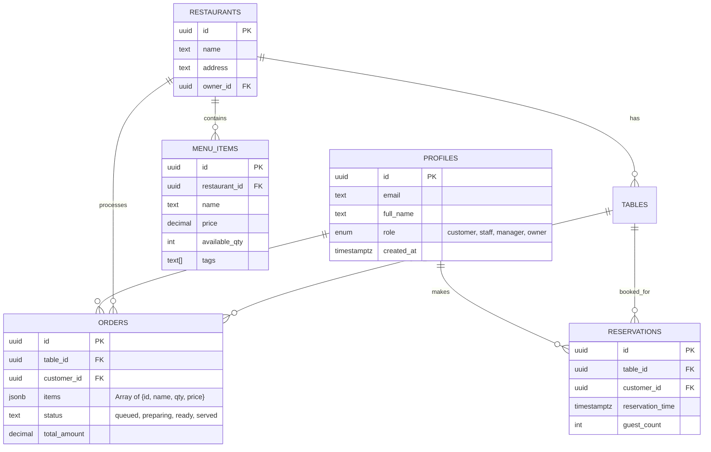

# 📊 Database Architecture & Entity Relationship Diagram (ERD)

## 1. Overview
SmartServe uses a **Relational Schema** designed for ACID compliance and real-time synchronization. The database is hosted on **Supabase (PostgreSQL)**.

## 2. ERD (Visual Representation)

## 3. Data Flow & Real-time
We utilize **PostgreSQL Listen/Notify** via Supabase Realtime Channels.
1. **Order Insert**: Triggered from Customer UI.
2. **Staff Broadcast**: Realtime channel pushes the payload to the Kitchen Kanban.
3. **Status Update**: Staff updates status → SQL `UPDATE` → Realtime broadcast → Customer Tracking UI.

## 4. Security (RLS)
- **Profiles**: `auth.uid() == id` (Users only see/edit their own profile).
- **Orders**: 
    - Customers: `auth.uid() == customer_id` (View only their own).
    - Staff/Manager: `true` (View all branch orders).
- **Inventory**: `role IN ('manager', 'owner')` (Only managers can update stock).
